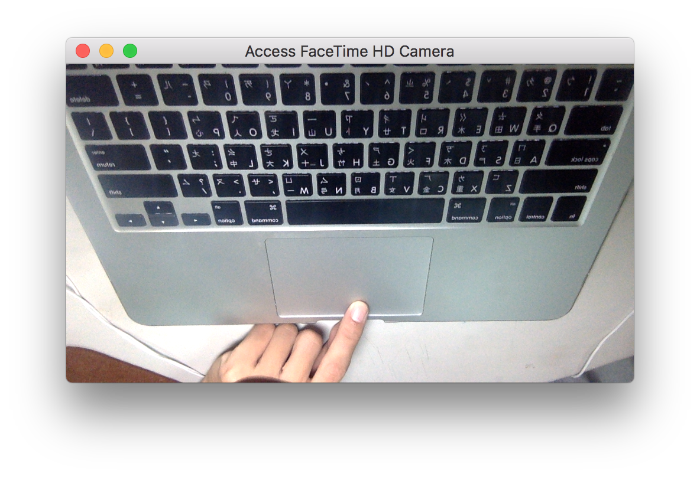

This is a demo of accessing FaceTime HD camera of MacBook. 

Since most tutorials and solutions are focusing on iOS implementation, this demo is made for macOS(OS X) Cocoa Application and was written in Swift. The input video stream will be displayed on the custom view in window controller.

## Environment

* MacBook Pro
* Swift version 3.0.2
* XCode Version 8.2.1
* macOS Sierra Version 10.12.2

## Not in this project

* Audio capture
* Image capture